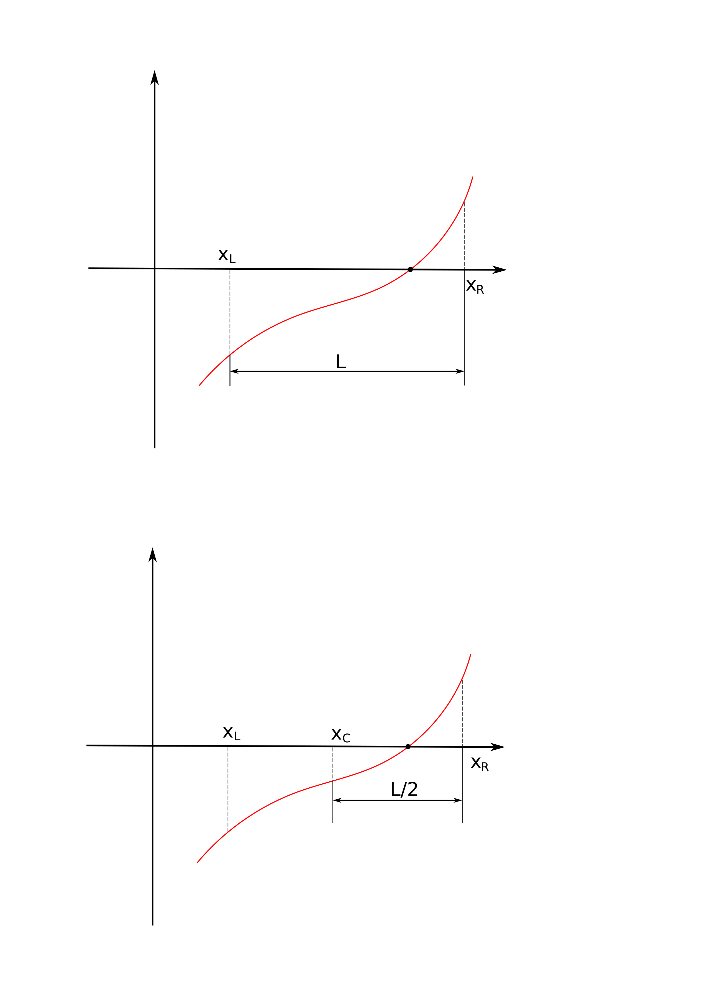

# Lecture 01 Vectors and Matrices


## row vectors行向量

$$
b = \begin{bmatrix}
1, 2, 3
\end{bmatrix}
$$


```python
import numpy as np

# ways to make a row vector
x1 = [1, 3, 2]
x2 = np.array([1, 3, 2])
x3 = np.matrix([1,3, 2])

display(x1)
display(x2)
display(x3)
```

## 列向量


```python
import numpy as np

# ways to make a column vector
x1 = np.matrix([[1], [3], [2]])
x2 = np.array([[1],[3],[2]])
display(x1)
display(x2)
```

## 更多表示方式
$$
b = \begin{bmatrix}
1\\
     2\\
     3
\end{bmatrix}
$$


```python
import numpy as np

x1 = np.arange(0, 11, 1)
x2 = np.arange(0, 11, 2)
x3 = np.arange(0, 1.2, 0.2)
x4 = np.arange(0, 9, 2)
x5 = np.arange(0, 5)

display(x1)
display(x2)
display(x3)
display(x4)
display(x5)
```

## Matrices矩阵表示
$$
A=\begin{bmatrix}
1 & 3 & 2\\
5 & 6 & 7\\
8 & 3 & 1
\end{bmatrix}
$$


```python
import numpy as np

A = np.array([[1, 3, 2], [5, 6, 7], [8, 3, 1]])
display(A)
```

## 矩阵切片，提取
$$
A=\begin{bmatrix}
1 & 3 & 2\\
5 & 6 & 7\\
8 & 3 & 1
\end{bmatrix}
$$


```python
x1 = A[1, 2]
x2 = A[1, :]
x3 = A[:, 2]
x4 = A[1:, 2]
display(x1)
display(x2)
display(x3)
display(x4)
```

## 向量转置 

$$
x = \begin{bmatrix}
2 + 3i \\
7\\
1
\end{bmatrix}
$$


```python
x = np.array([2+3j, 7, 1])
x1 = x.T
x2 = x.conjugate()
x3 = x.conj()
display(x)
display(x1)
display(x2)
display(x3)
```

# Lecture 02 Programming logic: IF and For，判断和循环语句

## The IF statement， if语句

```python
if (logical statement)
    (expressions to execute)
elif (logical statement)
    (expressions to execute)
elif (logical statement)
    (expressions to execute)
else
    (expressions to execute)
```

## The FOR loop, for循环


```python
import numpy as np

a = 0
for j in np.arange(0, 5):
    a = a + (j+1)
    display(a)
```


```python
import numpy as np

a = 0
for j in np.arange(0, 5, 2):
    a = a + (j+1)
    display(a)
```


```python
import numpy as np

a = 0
loop = [1, 5, 4]
for j in loop:
    a = a + j
    display(a)
```

## 算例，二分找根



## 算例1
$$
f(x) = exp(x) - tan(x)
$$


```python
xr = -2.8; xl = -4

for j in range(100):
    xc = (xr + xl) / 2
    fc = np.exp(xc) - np.tan(xc)
    if ( fc > 0 ):
        xl = xc
    else:
        xr = xc
        
    if ( abs(fc) < 1e-5 ):
        display(xc)
        display(j)
        break

```


```python
import numpy as np
import matplotlib.pyplot as plt


fig, ax = plt.subplots(figsize=(24, 12))
x = np.linspace(-4.1, -2, 1000)
y = 0*x

plt.plot(x, np.exp(x)-np.tan(x), color='k')
plt.plot(x, y, color='r')

plt.plot(-4, np.exp(-4)-np.tan(-4), marker='o', color='g')
plt.plot(-2.8, np.exp(-2.8)-np.tan(-2.8), marker='o', color='g')

plt.grid()
plt.ylim(-2, 2)


xr = -2.8; xl = -4

for j in range(100):
    xc = (xr + xl) / 2
    fc = np.exp(xc) - np.tan(xc)
    if ( fc > 0 ):
        xl = xc
    else:
        xr = xc
        
    if ( abs(fc) < 1e-5 ):
        break
    plt.plot(xc, fc, marker='o', color='k')
    plt.annotate(j, [xc, fc], color='r',fontsize=20)


```
